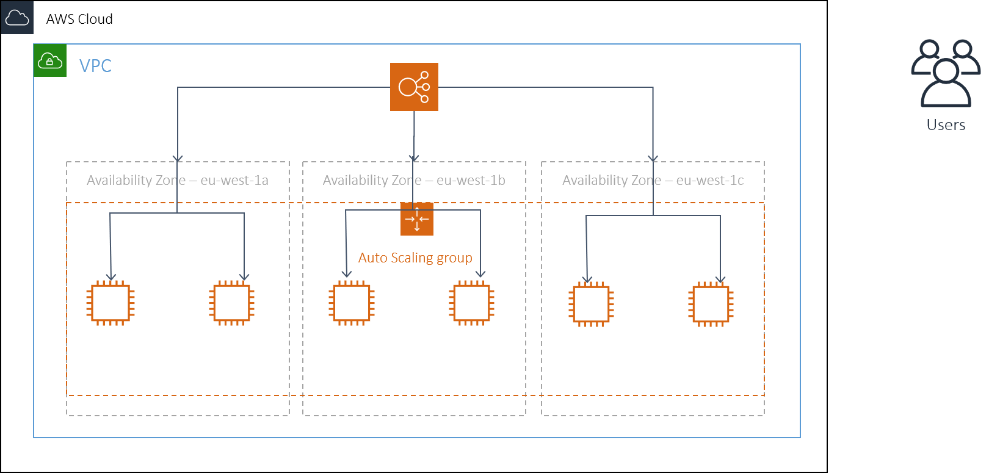

# AWS High Availability Setup Instructions

### Author Information

| Name | Student ID | Email Address |
| ---- | ---------- | ------------- |
| Declan Smyth | x00151293 | declan.smyth@gmail.com |

### Link to ScreenCast

A screen cast demonstrating the capabilities of the Test Harness is available from:
<https://www.screencast.com/t/l7xGEgEBHfTA>

## Introduction

The AWS High Availability environmnet is created using terraform to create the required infrastruction to test the re-instatement capabilities of Amazon Web Services' ability to maintain a high-availabilty environment

This is the high-level environemnt configuration that is implemented

| AWS Element          |  Configuration                   |
|----------------------|----------------------------------|
| Load Balancer        | ead-ca-loadbalancer              |
| Target Group         | ead-ca-targetgroup               |
| Auto Scaling Group   | ead-ca-autoscalegroup            |
| Launch Configuration | ead-ca-launchconfigurator        |
| Security Groups      | ead-ca-securitygrp-autoscalegrp  |
|                      | ead-ca-securitygrp--loadbalancer |
| SNS Topics           | ead-ca-test-results-notify       |
|                      | AWS-Test-Results                 |
|                      |                                  |

The auto scaling group will be configured to maintain a set number of intances that are evenly distributed across the availability zones

* Min number of instances = 6
* Max number of instances = 6

In this setup it will maintain the group at a fixed size and is not scalling in or out. It will monitor the availability zones and send an alert when an event happens.

## Environment Setup Instructions

### Pre-Requisites Software

The following software will be required to be installed on your system to run the AWS High-Availability Testing:

* GIT
* Python 3.7
* AWS Command Line Interface (CLI)
* Terraform

#### Installing Terraform 
You must download and deploy Terraform to create the test environment. The software is availalbe from HashiCorp at this link: <https://www.terraform.io/downloads.html>

To install Terraform in a **Linux Environment** perform the following steps:

1. Install Zip Unzip - `sudo yum install -y zip unzip`
2. Create a folder for the software download - `mkdir download`
3. Download the Terraform software into the download folder - `wget https://releases.hashicorp.com/terraform/0.11.13/terraform_0.11.13_linux_amd64.zip`
4. Inflate the downloaded zip file - `unzip terraform_0.11.13_linux_amd64.zip`
5. Move the **terraform** folder to /usr/local/bin - `mv terraform /usr/local/bin`
6. Test that Terraform is installed, run the command: `terraform --version`

To install Terraform in a **Windows Environment** perform the following steps:

1. Download the installation software from <https://www.terraform.io/downloads.html>
2. Unzip the contents into a location
3. Update the System Environmental Variables
  * Add a new system variable called : TERRAFORM
  * Set its value equal to the location you extracted the downloaded zip file
  * Add %TERRAFORM% to the PATH environmental variable

### Setup Python

To run test harness you need to install the following libraries:

* boto3 - `pip3 install boto3`

### Setting up AWS Credentials

To use the AWS command in boto3 you must configure your credentials. The easiest way to do this is to use the AWS CLI to perform this operation.
`aws configure`

Information about your AWS Account is required

* AWS Access Key ID
* AWS Secret Access Key
* Default regaion name

AWS have detailed instructions listed here: <https://docs.aws.amazon.com/cli/latest/usergude/cli-configure-files.html>

## Running the Tests

There are a number of steps to running the scripts to test the AWS High Availability implementations

### Creating the required environment

To set up your environment you must do the following:

#### Creating a tfvars file
Create & Configure a new file called *terraform.tfvars*. This file is used to provide configuration information for your AWS Environment. You must provide the following configuration infomration:
 * ACCESS_KEY
 * SECRET_KEY
 * SUBSCRIBER_EMAIL
 * SUBSCRIBER_PHONE
 * NUMBER_OF_INSTANCES
If this information is missing, the environment will be get created successfully. The file can be created with a text editor of your choice.

The file should be copied in the *infra/aws* folder. It will be used as part of the Terraform Plan and Apply commands

> **NOTE:** *Do not commit your AWS **ACCESS KEY**  or **Secret Key** into a repository that will be published*

#### Initialize Terraform

In the folder where the git repo has been cloned, go to the *infra* folder, then go into the *aws* folder

* Run the command `terraform init`.
* This will download the required provider plugins, in this case the *aws* provider

#### Deploy the Environment

The deployment of the environment is performed in two steps

1. Verify and Validate the depoyment using the command `terraform plan -out "out.plan"`
2. Apply the setup on the file *out.plan* using the command `terraform apply out.plan`

Status and confirmation will be displayed on screen indicating progress.

#### Warning...

Before the tests are  executed the following requirements must be met:

> * Python and boto3 installed
> * AWS Credentials Configured
> * Deployed the test environment

If these have not been done, the test will fail

### Executing the tests

To executes the tests goto the *scripts* folder in the location where you cloned the git repository

From this folder, run the  command - `python3 testharrness.py`, this will launch the test harness. 

When the scripts launch it will do the following:

* list the instances that are running in the auto scale group and provide their status
* Ask the user for the number of instances to terminate, up to the MAX number of running instances. 0 - (Zero) is used to exit

After the number of instances to terminate is provided the script will:

* List the instance IDs of the randomly selected instances to kill
* Present a list of the remaining running instances
* Start to time the re-instantment of the images
* Loop until the instances are recoveredand in a healthy state OR the time out has lapsed
  * The timeout is set to `*220 sec* x *number of instances to terminate*`
* The following tests are performed as part of the re-instatement checks:
  * Test 1 - Check if the number of instances in the group is the equal to desired level of the auto scale group
  * Test 2 - Check if all instances in the group are healthy
* When the test session has completed, tests results are presented to the user on screen
  * Start Time
  * Finish Time
  * Number of instances stopped
  * Number of instances started
  * Elapsed Time
  * Test Status
* Using AWS Simple Notification Services, a notification is sent to:
  * *Email Addresses* subscribed to the the TOPIC: **AWS-Test-Results**
  * *Mobile Phones* subscribed to the the TOPIC: **ead-ca-test-results-notify**
